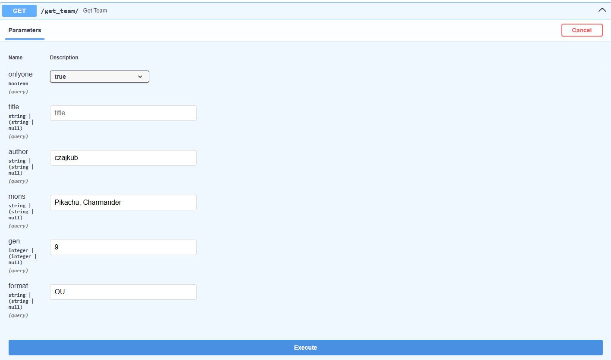
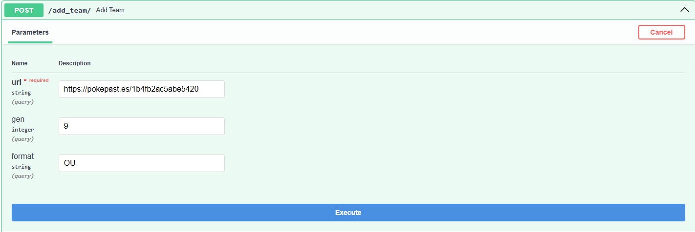

# smogon-sample-teams
API for getting sample Pokemon teams from Smogon

Hosted on [Render](https://render.com): [Link to Swagger UI](https://smogon-sample-teams.onrender.com/docs)

# About
This api was created in Python using [FastAPI](https://fastapi.tiangolo.com/). It is hosted on Render, with a Postgres database storing teams

# How to use:
First, you have to navigate to the Swagger UI provided on the Render service. You will see two endpoints: `/get_team/` and `/add_team/`

- To get a team:
  - Click the `/get_team/` endpoint and then `Try it Out`. You will be able to query the database based on multiple parameters:
    - onlyone: If true, select one random team from those fitting the criteria, if false every team fitting the criteria
    - title, author, generation, format
    - mons: list of Pokemon in team, separated by commas
  - Next, click `Execute`. You will see your team(s) at the bottom of the tab.

- To add a team:
  - Click the `/add_team/` endpoint and then `Try it Out`. You will be able to add a team with the following:
    - url: link to the [pokepaste](https://pokepast.es/)
    - (optional) gen: default is 9
    - (optional) format: default is OU
  - Next, click `Execute`. You will see whether your team was added to the database or if an error occurred.

